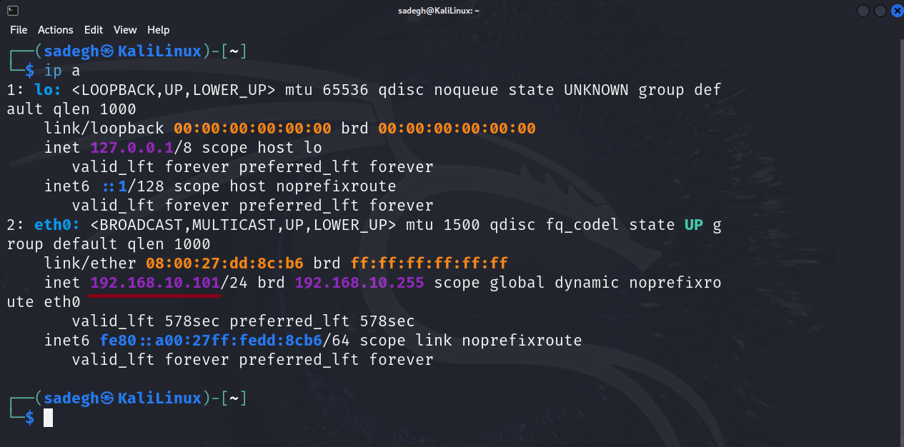

برای Kali تنظیمات خاصی نیاز نیست انجام دهید. تنها به تنظیمات ماشین مجازی رفته و در قسمت Network نوع آداپتور را بر روی Host-only Adapter قرار دهید.

ماشین مجازی را اجرا کرده و تنظیمات IP را با استفاده از دستور زیر ببینید:
```sh
ip a
```
مطابق تصویر زیر، ماشین مجازی باید در Subnet ما از DHCP آی پی گرفته باشد.

