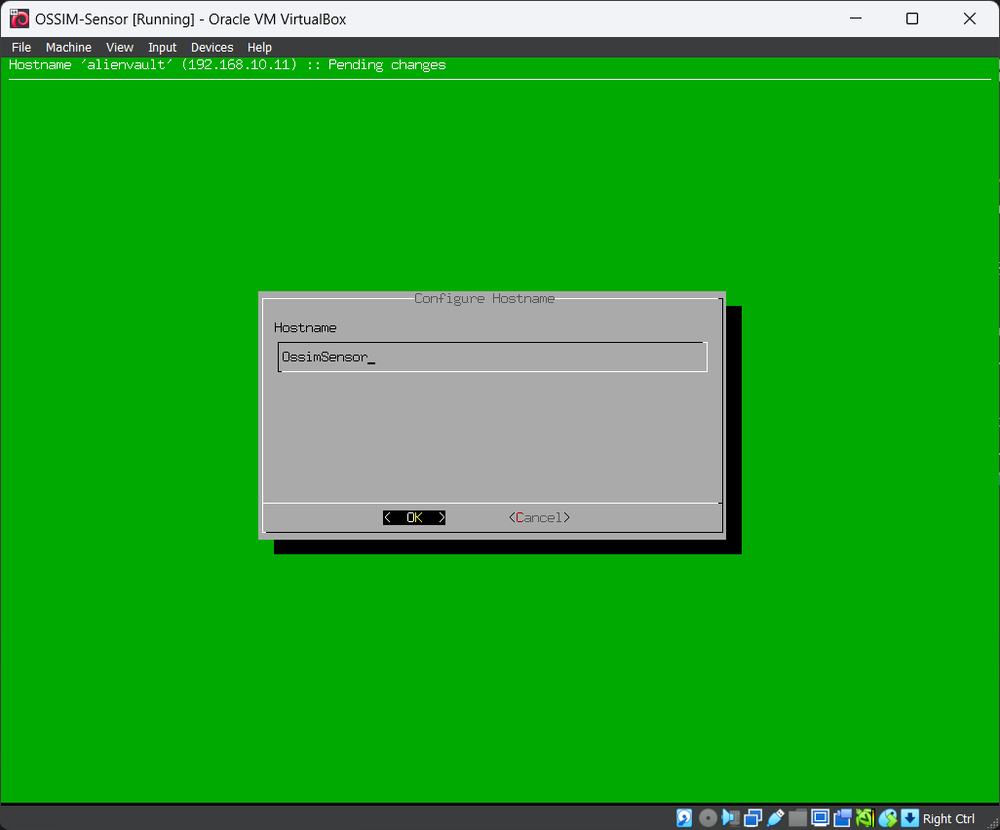
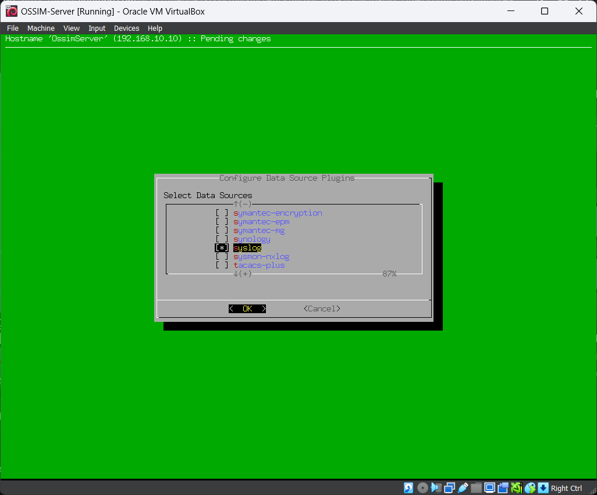
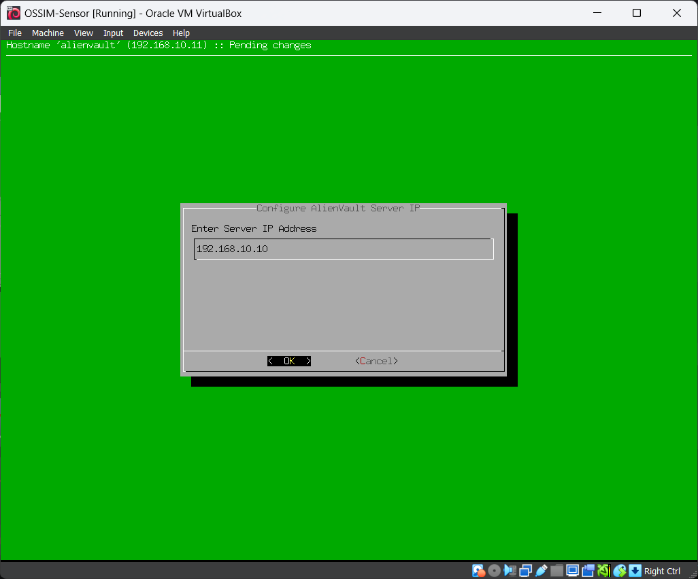
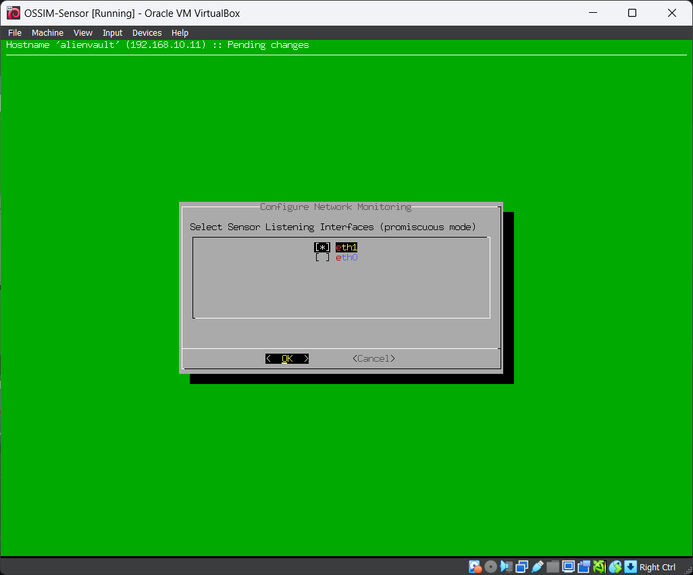
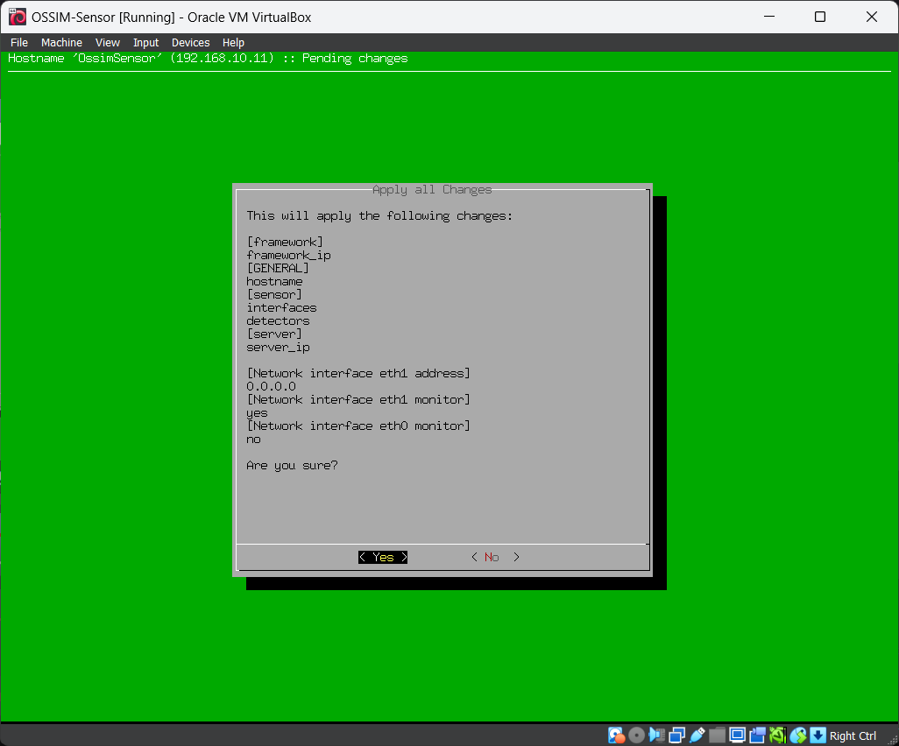
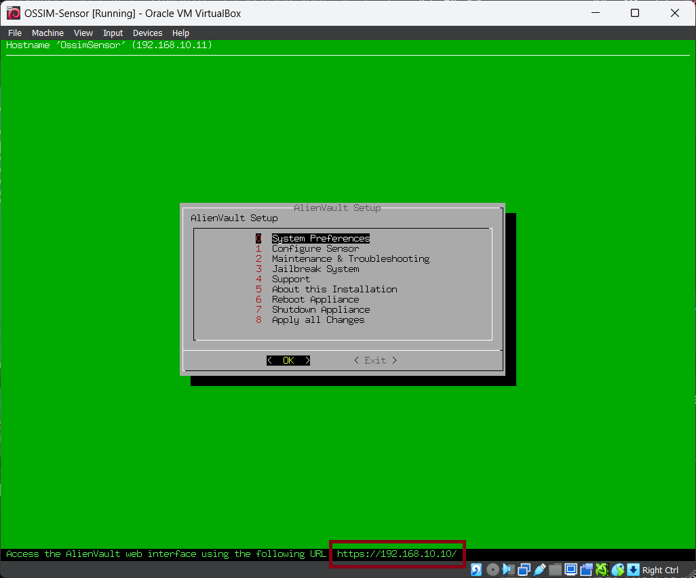

برای پیکربندی OSSIM Sensor، مراحل زیر را دنبال می‌کنیم.

1. در صورتی که ماشین مجازی در حال اجراست آن را خاموش کنید. می‌توانید از منوی OSSIM گزینه Shutdown All Appliance را انتخاب کنید.

2. وارد تنظیمات ماشین مجازی شده و در بخش Network نوع Adapter را بر روی Host-only Adapter قرار دهید.

3. برای Sensor نیاز به یک آداپتور شبکه دوم نیز داریم تا تمامی ترافیک شبکه را روی این ماشین مجازی دریافت کنیم. برای این کار به زبانه Adapter 2 رفته و یک آداپتور Host-only Adapter را انتخاب کنید. در قسمت Advanced نیز Promiscuous Mode را بر روی Allow All قرار دهید. این گزینه امکان دریافت تمامی ترافیک شبکه توسط این VM را فراهم می‌کند.

:::note
در لینوکس، اینترفیس‌های شبکه از eth0 شروع شده و به ترتیب اینترفیس‌های بعدی eth1, eth2 و ... نام می‌گیرد. در اینجا آداپتور اول ما eth0 نام دارد و اداپتوری که حالت Promiscuous Mode را برای آن فعال کردیم eth1 خواهد بود.
:::

4. ماشین مجازی OSSIM Sensor را اجرا کرده و لاگین کنید.

5. اولین کاری که می‌کنیم به قسمت System Preferences > Configure Hostname رفته و یک Hostname متناسب به آن اختصاص می‌دهیم. ما از OssimSensor استفاده می‌کنیم.

6. مشابه OSSIM Server، باید Syslog را فعال کنیم. به صفحه اول برگردید و به قسمت Configure Sensor > Configure Data Source Plugins بروید. Syslog را پیدا کرده و با کلید Space آن را فعال کنید و Ok را بزنید.

7. به مسیر Configure Sensor > Configure AlienVault Server IP بروید و آدرس آی پی OSSIM Server را وارد کنید.

8. به مسیر Configure Sensor > Configure AlienVault Framework IP بروید و اینجا نیز همان آدرس آی پی OSSIM Server را وارد کنید.

9. به مسیر Configure Sensor > Configure Network Monitoring بروید. در اینجا اینترفیس شبکه‌ای که باید ترافیک شبکه را ضبط و دریافت کند انتخاب می‌کنیم. همانطور که گفتیم، حالت Promiscuous Mode را برای اینترفیس eth1 در OSSIM Sensor فعال کرده بودیم. آن را انتخاب کرده و eth0 را از حالت انتخاب در می‌آوریم.

10. به صفحه اول برگردید و Apply All Changes را بزنید. صبر کنید تا تنظیمات ذخیره شود.

11. پس از ریستارت شدن، باید IP سرور را در پایین صفحه مشاهده کنید.

