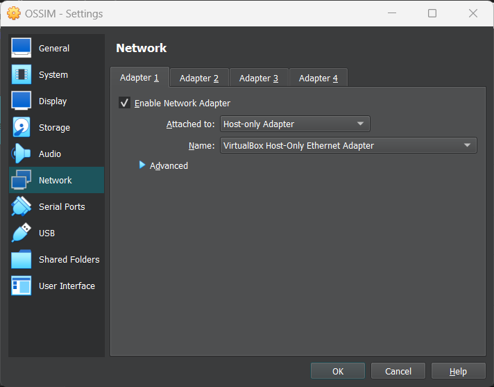
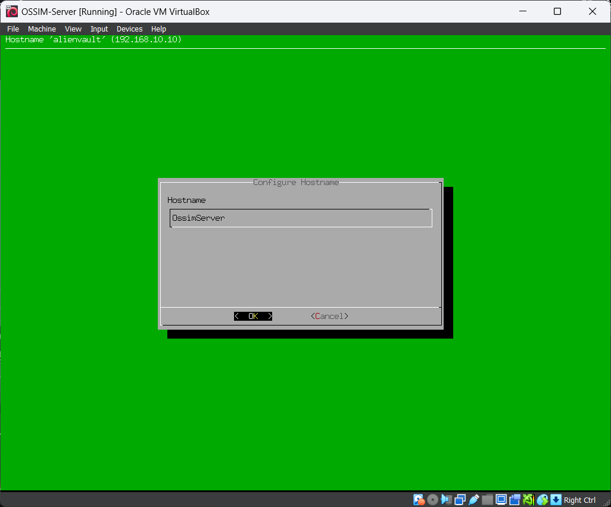
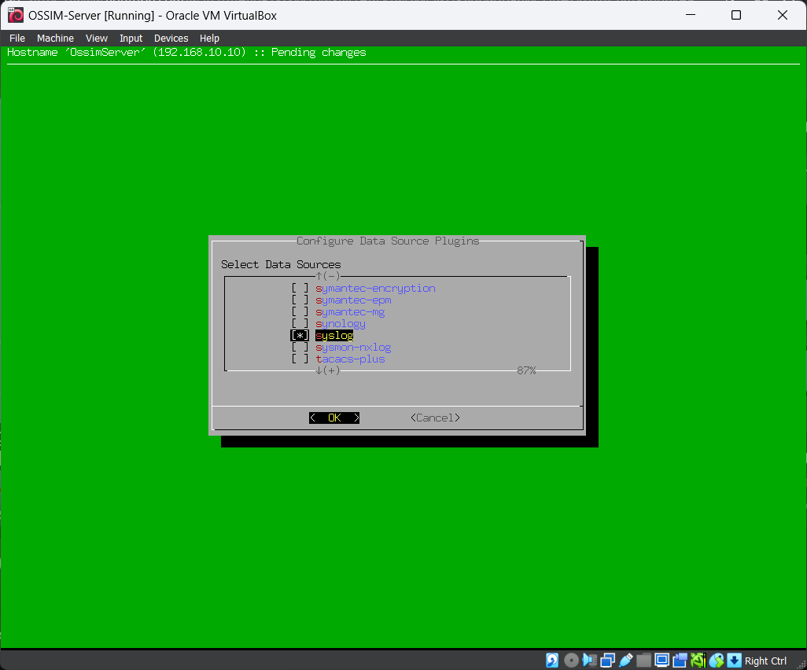
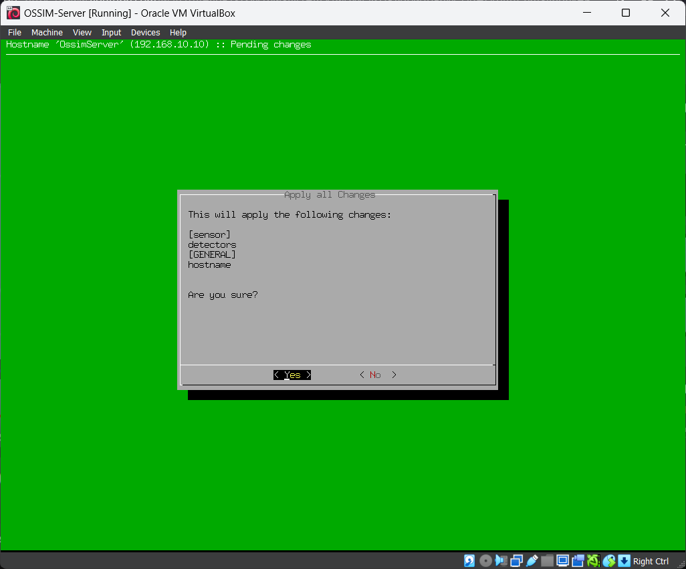

برای پیکربندی OSSIM Server، مراحل زیر را دنبال می‌کنیم.

1. در صورتی که ماشین مجازی در حال اجراست آن را خاموش کنید. می‌توانید از منوی OSSIM گزینه Shutdown All Appliance را انتخاب کنید.

2. وارد تنظیمات ماشین مجازی شده و در بخش Network نوع Adapter را بر روی Host-only Adapter قرار دهید.

3. ماشین مجازی OSSIM Server را اجرا کرده و لاگین کنید.

4. اولین کاری که می‌کنیم به قسمت System Preferences > Configure Hostname رفته و یک Hostname متناسب به آن اختصاص می‌دهیم. ما از OssimServer استفاده می‌کنیم.

5. اکنون باید Syslog را فعال کنیم. به صفحه اول برگردید و به قسمت Configure Sensor > Configure Data Source Plugins بروید. Syslog را پیدا کرده و با کلید Space آن را فعال کنید و Ok را بزنید.

6. به صفحه اول برگردید و Apply All Changes را بزنید. صبر کنید تا تنظیمات ذخیره شود.

