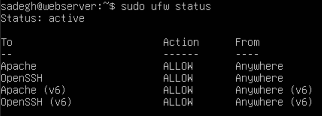

ماشین مجازی Webserver را اجرا کرده و در Ubuntu Server لاگین کنید.

### 1. به روزرسانی پکیج‌ها
ابتدا تمامی پکیج‌ها را به روزرسانی کنید.

```sh
sudo apt update
sudo apt upgrade -y
```

### 2. نصب Apache
ما برای وب سرور از Apache استفاده می‌کنیم. البته شما می‌توانید از سایر وب سرورها مثل Nginx یا Caddy نیز استفاده کنید.
```sh
apt install apache2
```
چک کنید که سرویس apache2 بدون مشکل راه اندازی شده است:
```sh
systemctl status apache2
```


### 3. تنظیم فایروال
دسترسی Apache2 و OpenSSH را در فایروال باز کنید:
```sh
sudo ufw allow Apache
sudo ufw allow OpenSSH
sudo ufw enable
```

با دستور `sudo ufw status` میتوانید وضعیت فایروال را چک کنید.



### 4. تنظیم IP
یک IP استاتیک در Subnet که در مراحل قبل تعریف کردیم به وب سرور اختصاص دهید. ما `192.168.10.20` را اختصاص می‌دهیم. تنظیمات IP در Ubuntu Server 24.04 در مسیر `etc/netplan/50-cloud-init.yaml/` قرار دارد.
ابتدا یک بکاپ از فایل بگیرید تا در صورت ایجاد مشکل بتوانیم تنظیمات را بازیابی کنیم:
```sh
sudo cp /etc/netplan/50-cloud-init.yaml /etc/netplan/50-cloud-init.yaml.bak
```
فایل را با یک ویرایشگر متن مثل nano باز کنید:
```sh
sudo nano /etc/netplan/50-cloud-init.yaml
```
و تنظیمات را به صورت زیر جایگزین کنید:
```yaml
network:
  version: 2
  renderer: networkd
  ethernets:
    enp0s3:
      dhcp: false
      addresses:
        - 192.168.10.20/24
      routes:
        - to: default
          via: 192.168.10.1
```

ماشین مجازی را خاموش کنید. وارد تنظیمات ماشین مجازی شوید و در قسمت Network نوع آداپتور را بر روی Host-only Adapter قرار دهید.