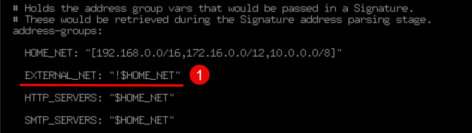
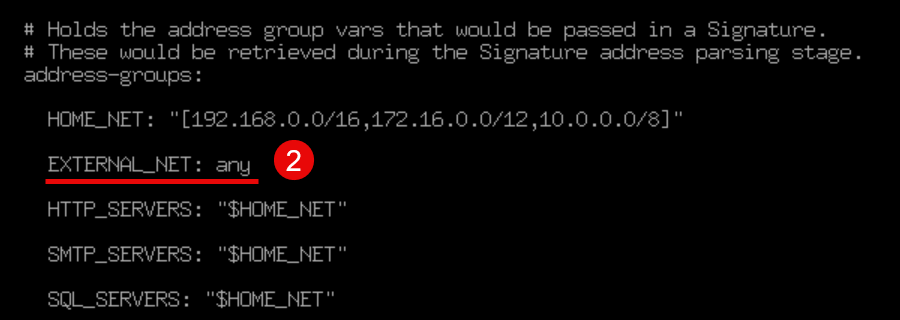

## NIDS چیست؟

NIDS یا Network-Based Intrusion Detection System، سیستم تشخیص نفوذ تحت شبکه است که با قرارگیری در مسیر ترافیک شبکه، گزارش های مربوط به تشخیص نفوذ به شبکه و فایروال را به SIEM ارائه می‌دهند. در OSSIM برای NIDS از Suricata استفاده می‌شود.

## Suricata چیست؟

Suricata سیستم تشخیص نفوذ تحت شبکه است که به صورت پیش فرض در SIEM OSSIM استفاده می‌شود.

برای تنظیم OSSIM به OSSIM Sensor رفته و لاگین کنید. سپس وارد بخش Jailbreak شوید. 

 برای پیکربندی Suricata فایل پیکربندی آن را با یک ویرایشگر متن مثل Nano باز کنید:
```sh
nano /etc/suricata/suricata.yaml
```

به طور پیش فرض، Suricata ترافیک لوکال به لوکال را مانیتور نمی‌کند. چون در محیط داخلی و لوکال هستیم، نیاز است تا فایروال را به گونه تنظیم کنیم که تمامی ترافیک را مانیتور کند:

خط `EXTERNAL_NET` را پیدا کنید و مقدار آن را از `"!$HOME_NET"` به `any` تغییر دهید.



