ابتدا تمامی ماشین مجازی ها را اجرا کنید. سپس در محیط Kali چک می‌کنیم که پینگ OSSIM-Server, OSSIM-Sensor و Webserver را داشته باشیم:
```sh
# OSSIM Server
ping 192.168.10.10

# OSSIM Sensor
ping 192.168.10.11

# Webserver
ping 192.168.10.20
```
مثل تصویر زیر باید پینگ همه سرورها را داشته باشیم:
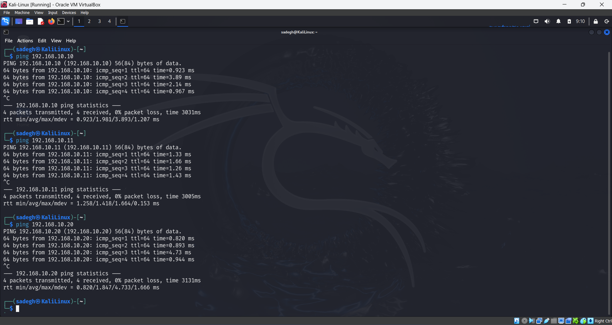

فایرفاکس را باز کنید (در Kali Linux) و آدرس OSSIM Server یعنی `192.168.10.10` را وارد کنید. Advanced و سپس Accept the risk and continue را بزنید تا وارد محیط تحت وب OSSIM شوید.

نام، پسورد و ایمیل دلخواه را وارد کنید و Start Using AlienVault را بزنید.
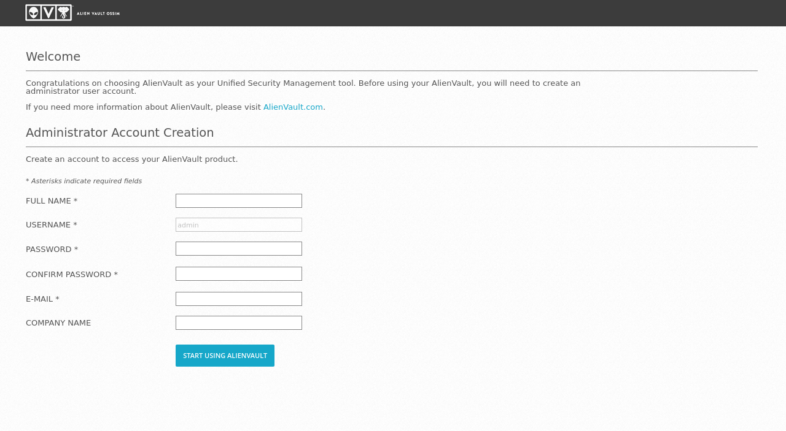

یوزر و پسورد که در مرحله قبل انتخاب کردید را وارد کرده و لاگین کنید.
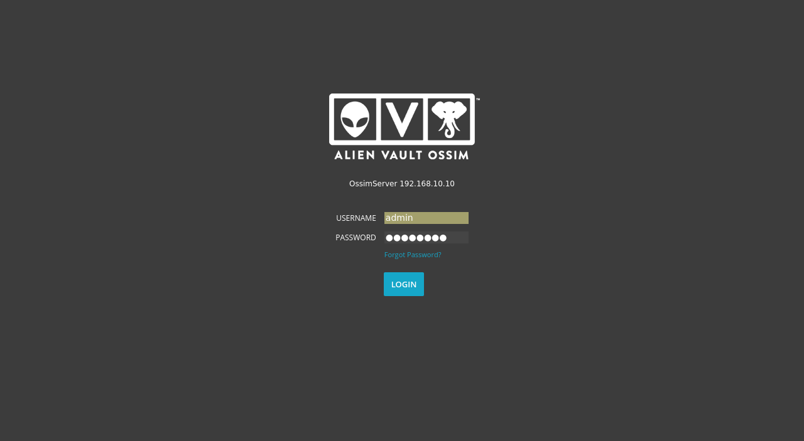

در این صفحه 4 قسمت داریم:
### Network Interfaces
در قسمت اول آدرس اینترفیس مدیریت OSSIM را مشاهده می‌کنیم که همان `192.168.10.10` است. Next را بزنید.


### Asset Discovery
در این قسمت لیستی از سرورهایمان را مشاهده می‌کنیم. ابتدا نوع سرور ها را در قسمت Type مشخص کنید. `192.168.10.1` گیت وی شبکه است و نیازی نیست نوع آن را مشخص کنید. 3 سرور دیگر نیز OSSIM Server، OSSIM Sensor و Kali Linux هستند که نوع هر 3 آن‌ها لینوکس است.
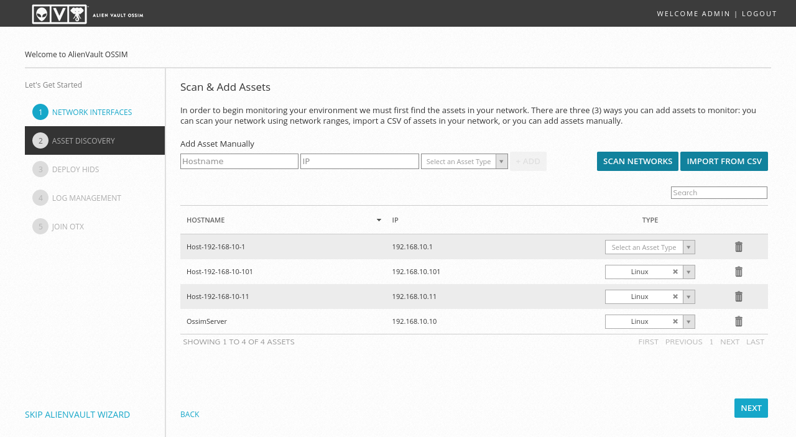

وب سرور اوبونتو را نیز باید به لیست سرورها اضافه کنیم. از قسمت بالا نام و IP وب سرور را وارد کرده و نوع آن را نیز Linux انتخاب می‌کنیم. سپس ADD را زده تا وب سرور نیز اضافه شود.

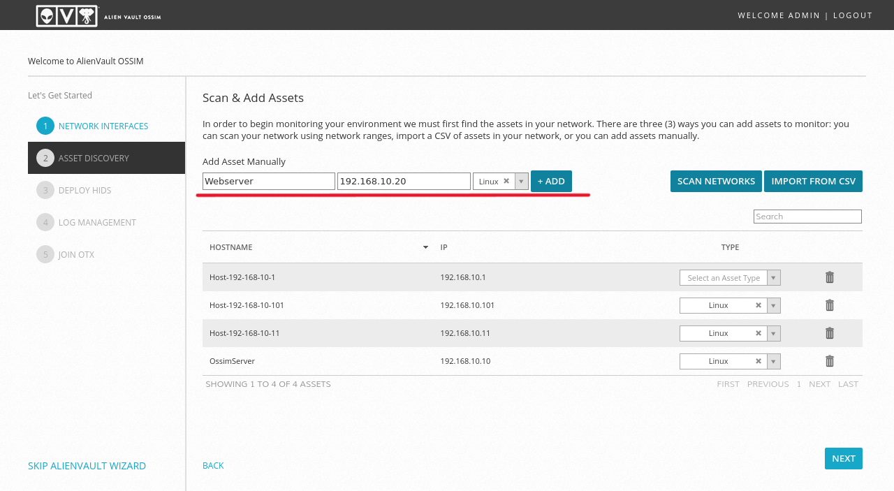

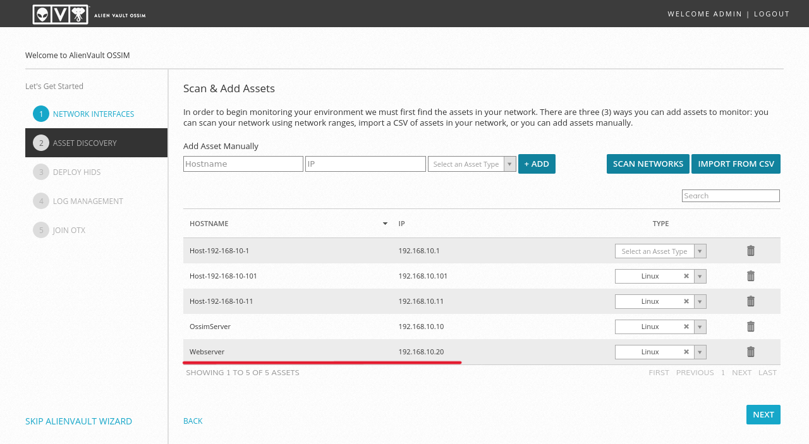

### Deploy HIDS
در این قسمت HIDS را بر روی OSSIM Server، OSSIM Sensor و Webserver راه اندازی میکنیم. از آن جایی که یوزر و پسورد OSSIM Server و OSSIM Sensor با Webserver متفاوت است، ابتدا HIDS را بر روی OSSIM Server و OSSIM Sensor راه اندازی می‌کنیم. برای این کار از سمت راست OSSIM Server و OSSIM Sensor را انتخاب کنید و یوزر (root) و پسورد Server و Sensor را وارد کنید.


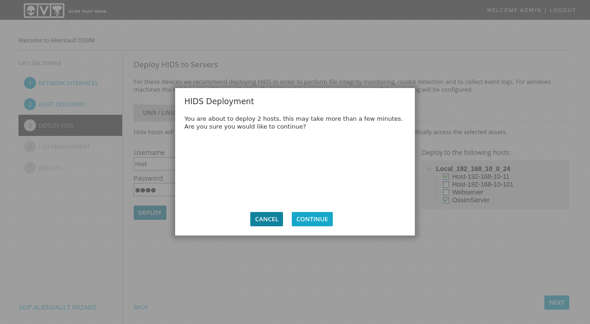

صبر کنید تا HIDS راه اندازی شود

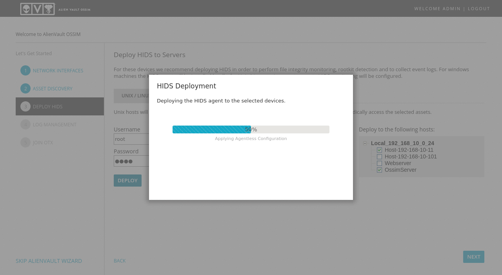

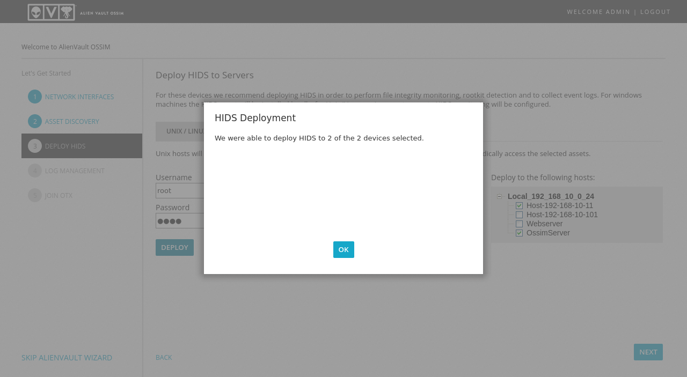

سپس همین کار را برای Webserver انجام می‌دهیم.

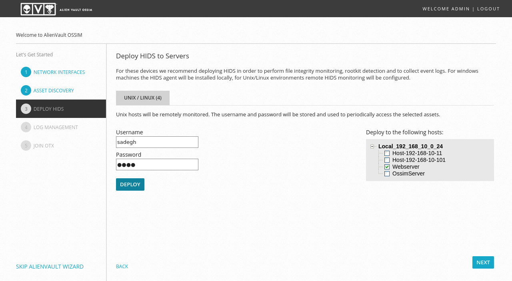
### Log Management
چون هیچ دستگاه شبکه‌ای مثل روتر، سوییچ و ... نداریم، در اینجا چیزی برای نمایش وجود ندارد. Skip this step را بزنید.

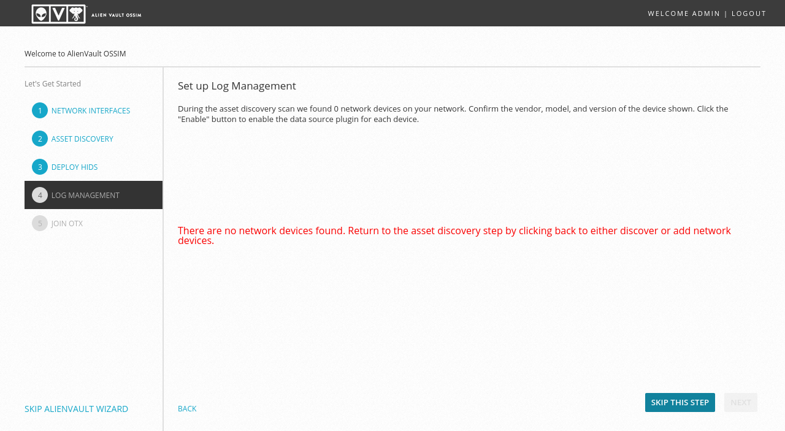

### Join OTX
OTX مخفف Open Threat Exchange یک سرویس Threat Intelligence است که اطلاعات تهدیدات و آسیب پذیری ها را به ما ارائه می‌دهد. از آن جایی که ما در این جا اینترنت نداریم، از این مرحله رد می‌شویم اما در یک سناریو واقعی، استفاده از این سرویس امری حیاتیست. Skip This Step و سپس Finish را بزنید تا پیکربندی OSSIM SIEM به پایان برسد. Explore AlienVault OSSIM را بزنید تا وارد داشبرد OSSIM شوید.

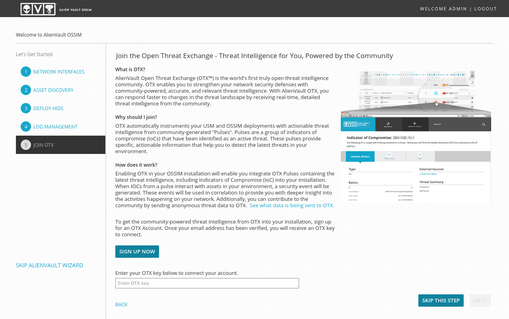