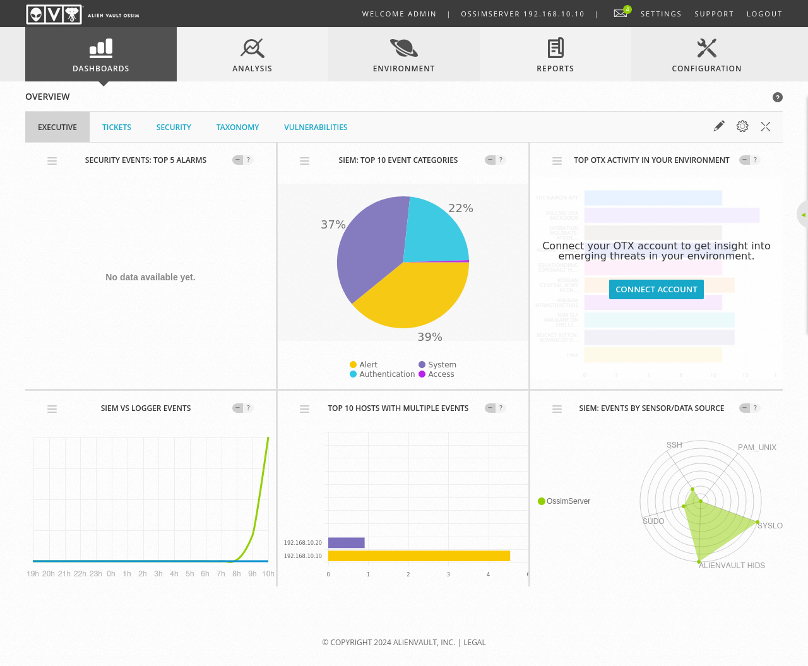
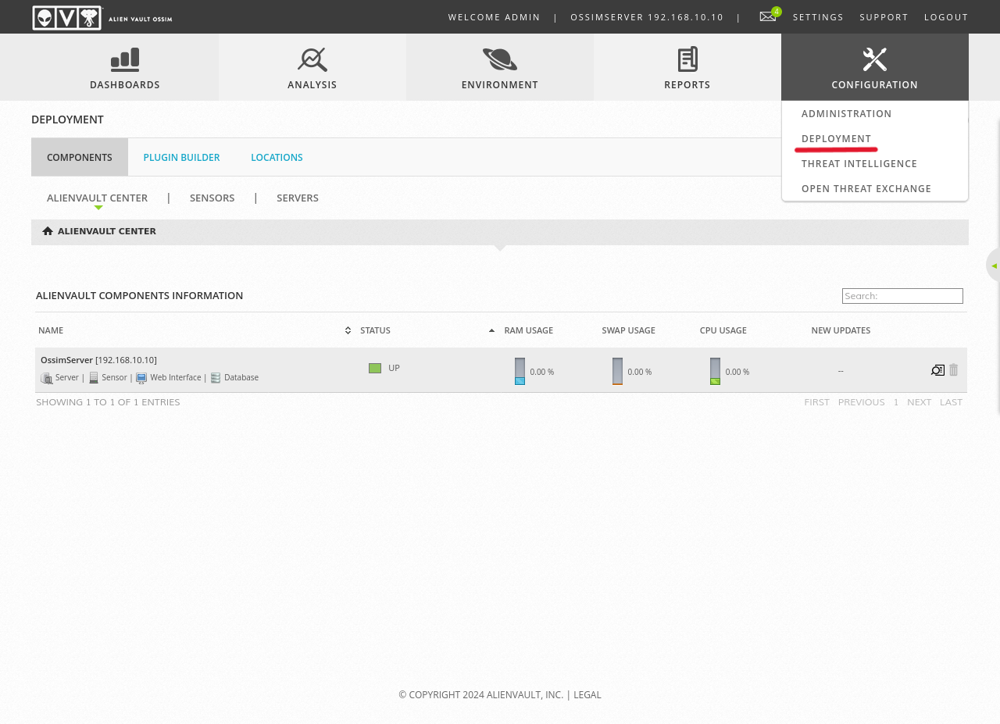
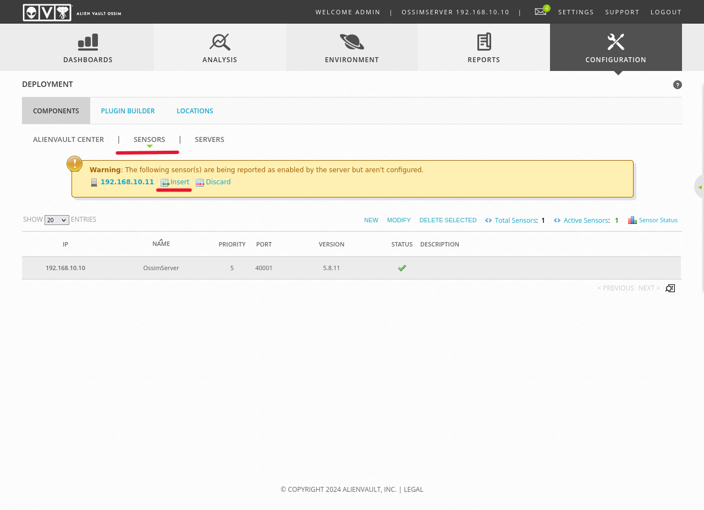
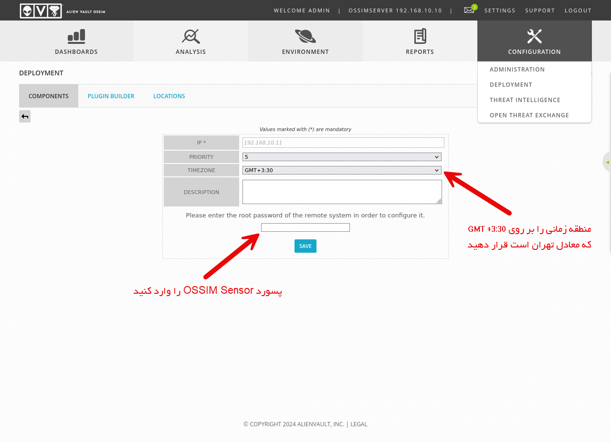
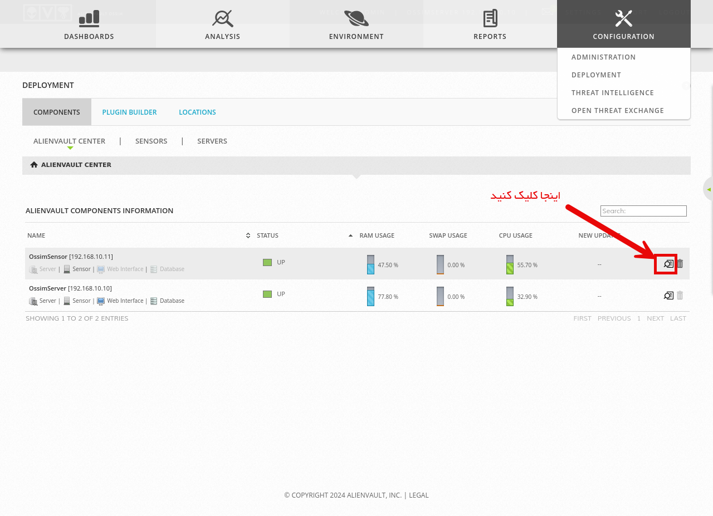
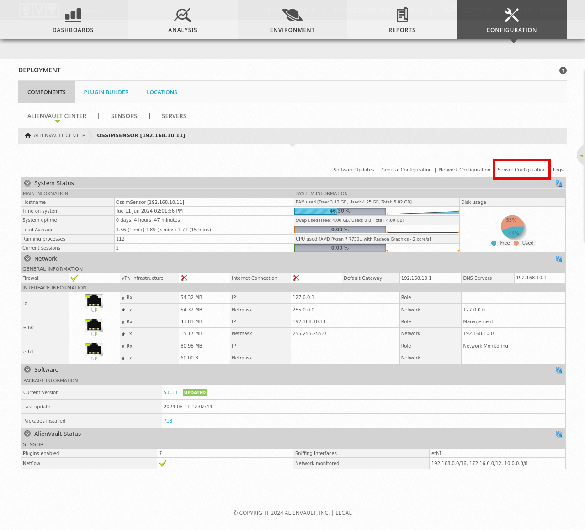
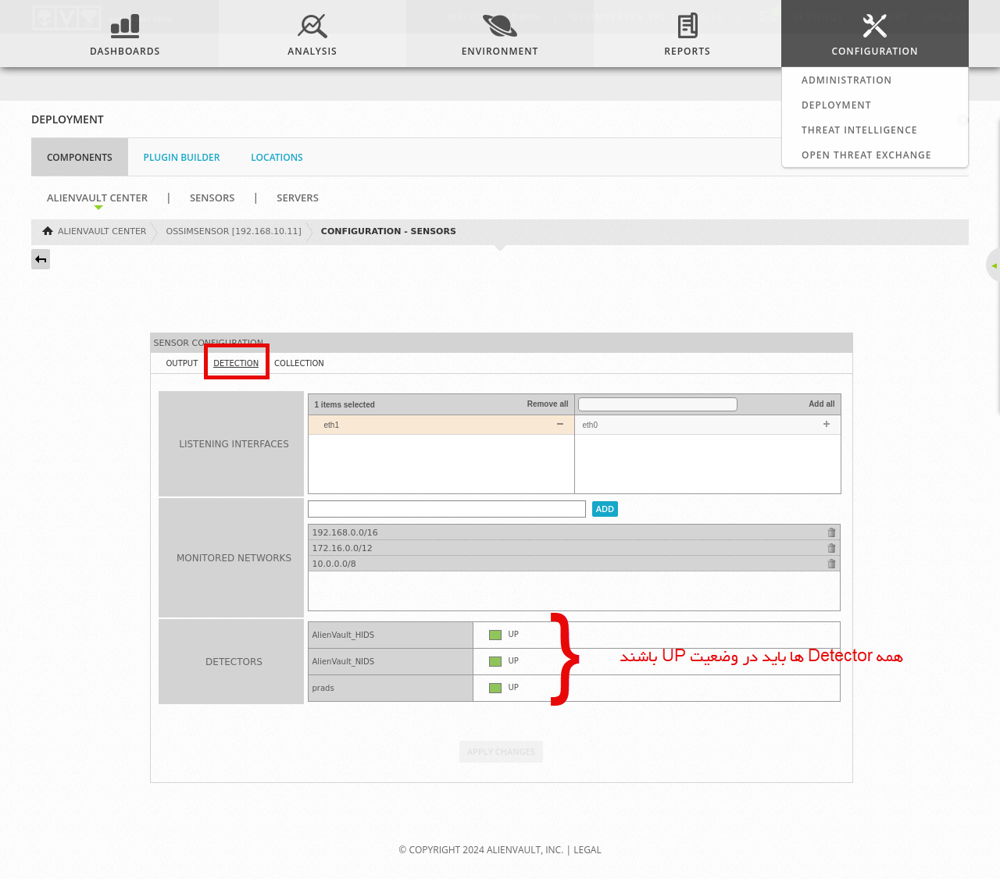

در اینجا داشبورد OSSIM را می‌بینید و می‌توانید بخش های مختلف آن را بررسی کنید.

از منوی بالا به مسیر Configuration > Deployment بروید. در اینجا می‌توانید وضعیت سرورها را مشاهده کنید، همچنین در این قسمت باید OSSIM Sensor را که در بخش های قبلی پیکربندی کردیم فعال کنیم.

در سربرگ اول وضعیت کلی OSSIM Server را می‌بینید. به سربرگ SENSORS بروید.

Insert را بزنید و پسورد OSSIM Sensor را وارد کرده و Save را بزنید.

می‌توانید با انتخاب گزینه Details، اطلاعات دقیقی از وضعیت هر سرور را ببینید:

به Details OSSIM Sensor بروید و بر روی Sensor Configuration کلیک کنید.

به سر برگ Detections بروید. در پایین باید همه Detector ها در وضعیت فعال باشند:

