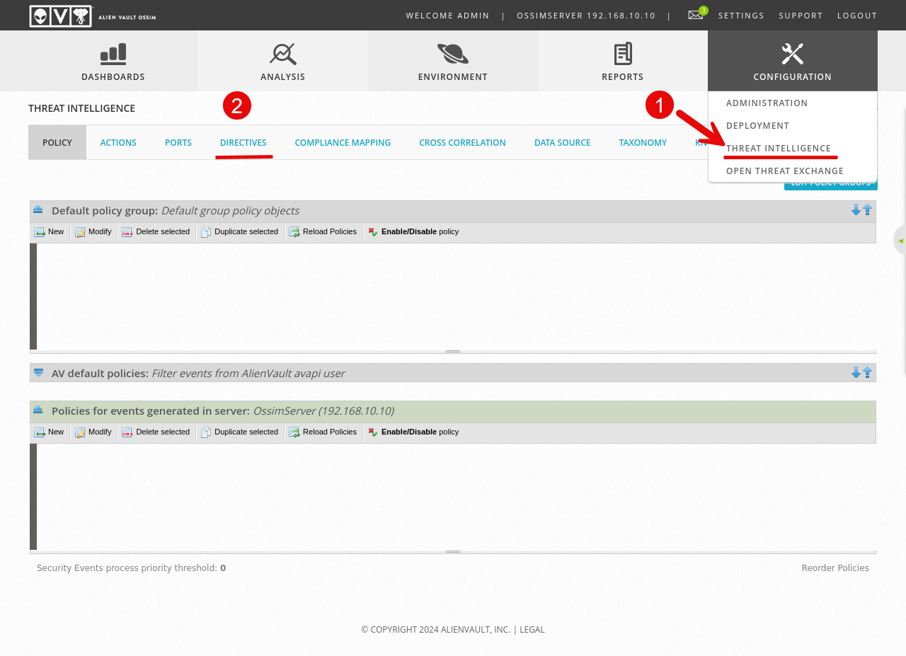
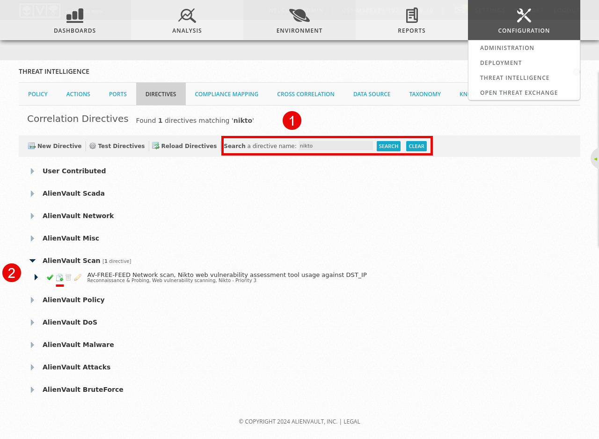
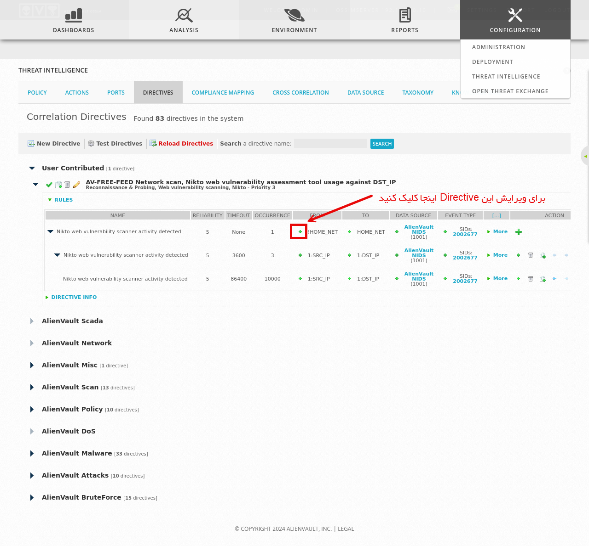
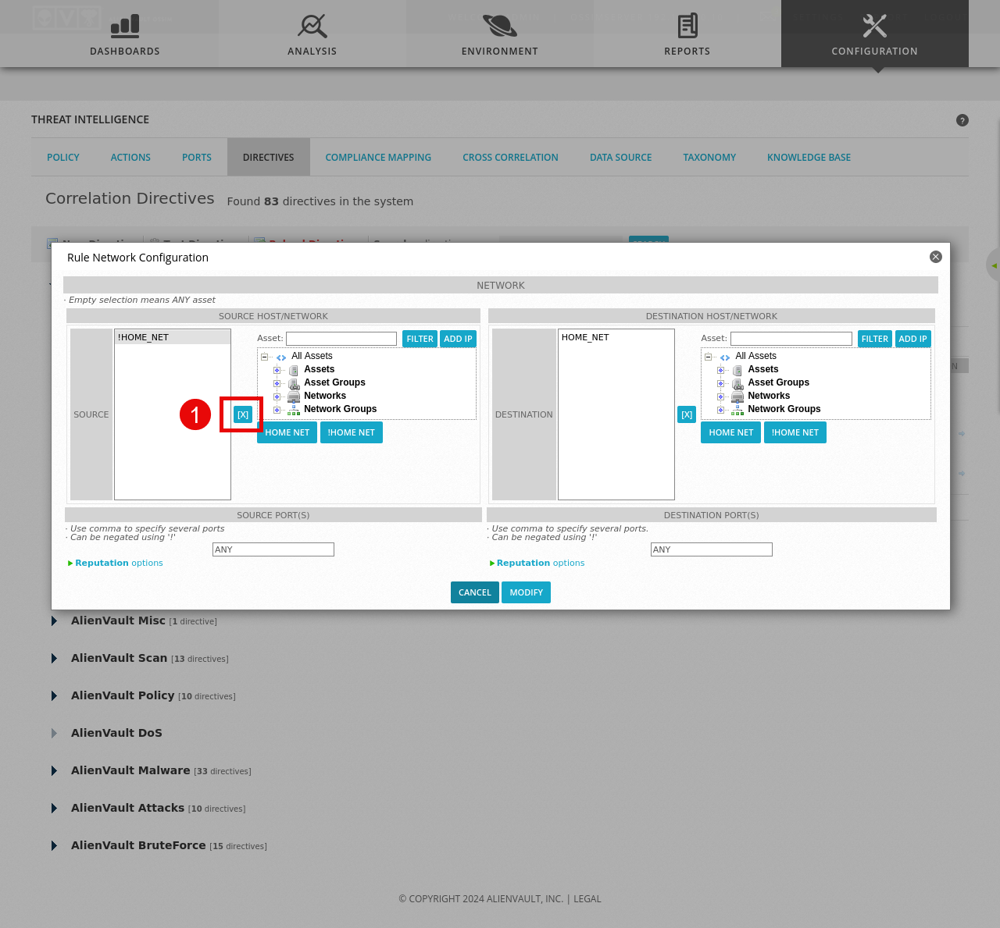
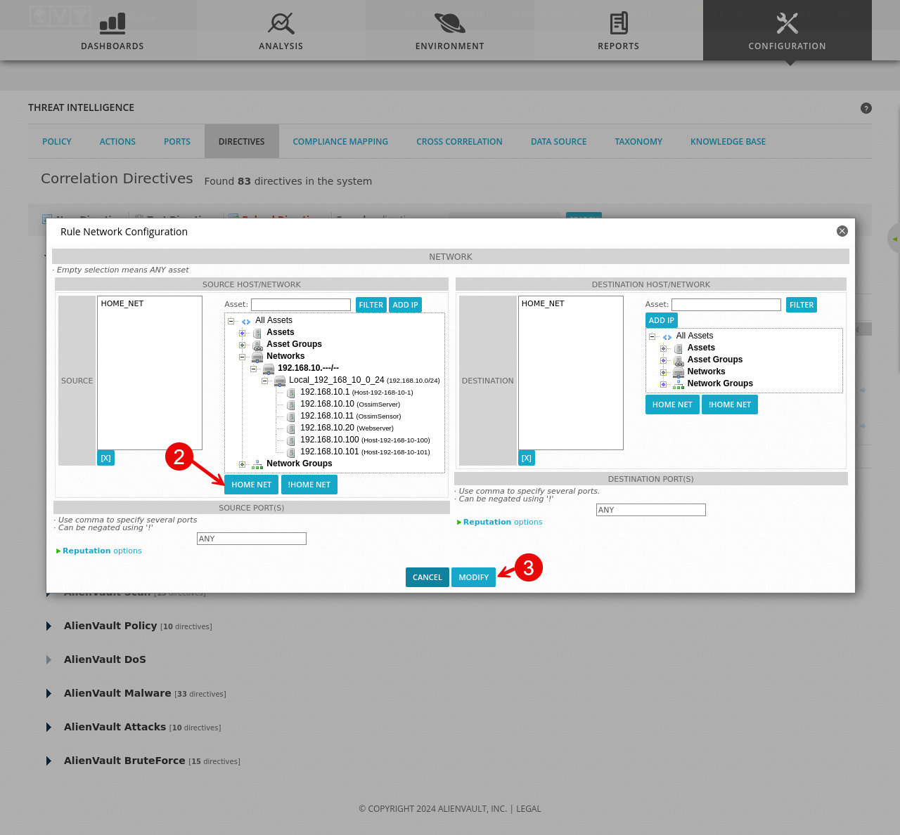
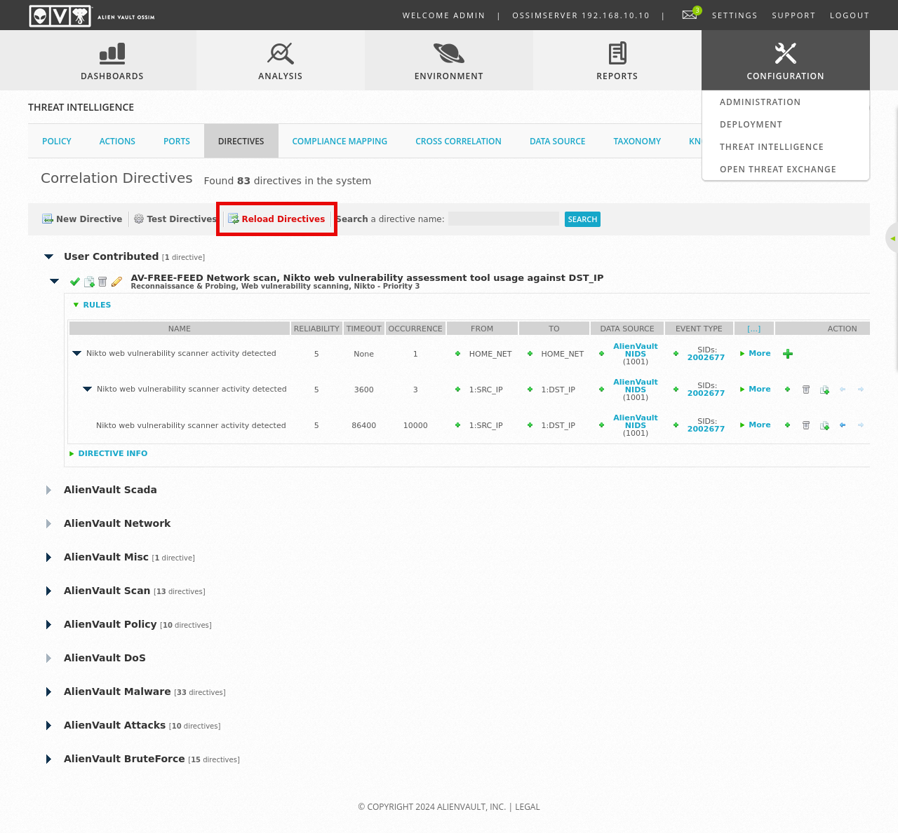

## Directives چیست؟
Directives مجموعه قوانین و رول هاییست که به شناسایی و پاسخ به رخدادهای امنیتی کمک می‌کند. Directive ها را می‌توان برای هر ماژولی تعریف یا شخصی سازی کرد، در OSSIM به طور پیش فرض حدود 2000 Directive وجود دارد.

## Nikto چیست؟
Nikto یک اسکنر آسیب پذیری مشابه Nessus، GVM و غیره است که به صورت پیش فرض در OSSIM وجود دارد.

ما در اینجا یکی از Directive های Nikto را مطابق با محیط آزمایشی خود شخصی سازی می‌کنیم.

برای تنظیم Directives، از منوی بالا به قسمت Configuration > Threat Intelligence و سپس به سربرگ Directives بروید.

در باکس جستجو، `nikto` را جستجو کنید . مطابق تصویر بر روی Clone کلیک کنید تا یک کپی از این رول ایجاد شود، ما تغییرات خود را بر روی این کپی انجام می‌دهیم.

علامت `+` را مطابق تصویر بزنید.

همانطور که مشاهده می‌شود Source Host/Network ما بر روی `!HOME_NET` قرار دارد. علامت `!` به معنی نفی کننده بود و این یعنی شبکه و هاست مبدا ما در حالت پیش فرض بر روی ترافیک های غیر از ترافیک لوکال و محلی است. اما چون ما به صورت لوکال در حال کار هستیم، باید سورس را نیز از شبکه داخلی قرار دهیم.
برای این کار ابتدا بر روی [x] کلیک کنید تا `!HOME_NET` حذف شود.

به زیر شاخه Networks > 192.168.10..../... > Local_192_168_10_0_24 بروید، اینجا می‌توانید تمامی سرورهای داخلی را ببینید، در صورتی که میخواهید تمام ترافیک داخلی را مانیتور کنید، بر روی گزینه HOME NET کلیک کنید تا `HOME_NET` به عنوان سورس شبکه قرار گیرد. Modify را زده تا تنظیمات ذخیره شود. سپس Reload Directives را بزنید تا قوانین بر اساس تنظیمات جدید به روز شوند.

