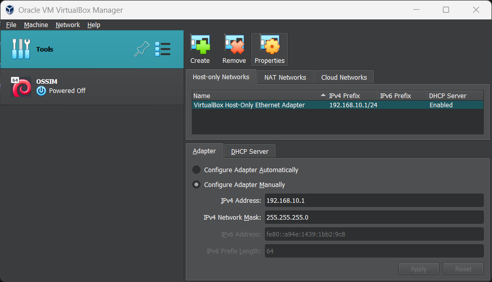
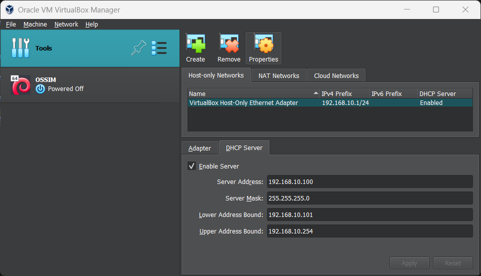

پیش از ساخت ماشین مجازی، ابتدا باید پیکربندی VirtualBox را انجام دهیم.
به قسمت Tools > Network بروید. برای پیکر بندی شبکه ماشین مجازی، ابتدا باید یک Subnet به ماشین مجازی اختصاص دهیم. ما از `192.168.10.0/24` استفاده کردیم، اما شما می‌توانید از هر Subnet که دوست داشتید استفاده کنید، فقط دقت کنید که مراحل بعدی را نیز با Subnet انتخابی خود وفق دهید.



تنظیمات DHCP Server را نیز مطابق با Subnet تعیین شده، تغییر دهید.



در مراحل بعدی باید به OSSIM Server و OSSIM Sensor در همین Subnet آی پی اختصاص دهیم. ما به ترتیب از 192.168.10.10 و 192.168.10.11 استفاده می‌کنیم.
در نهایت، آدرس ماشین مجازی های ما به این صورت خواهد شد:
```
Subnet: 192.168.10.0/24

OSSIM-Server: 192.168.10.10

OSSIM-Sensor: 192.168.10.11
```