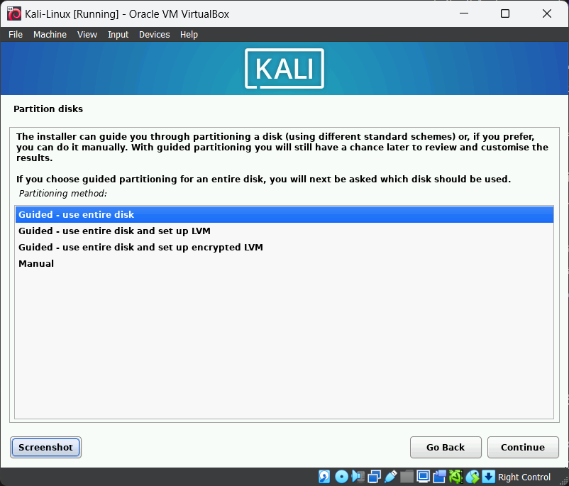
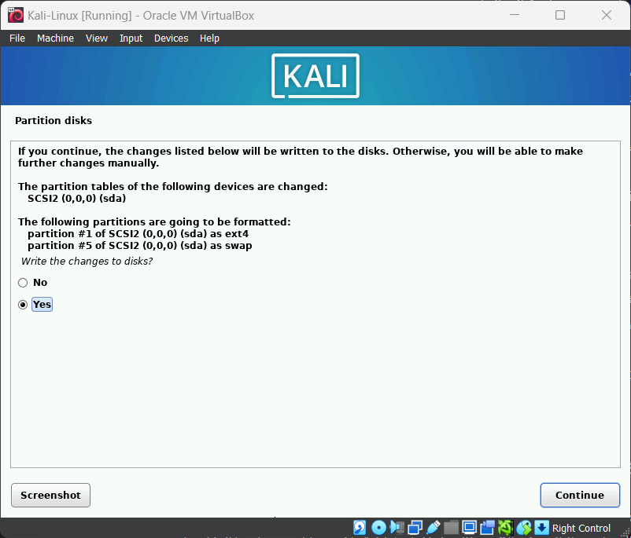
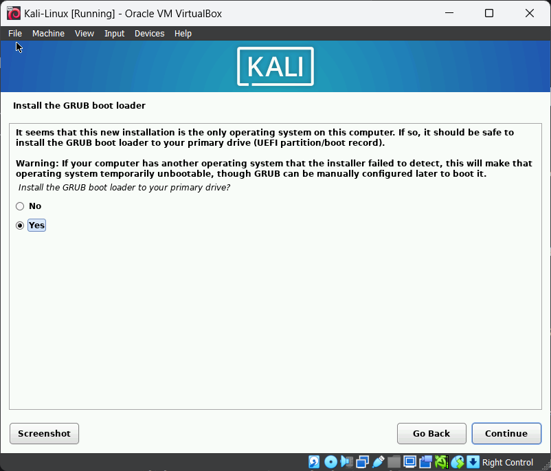

نصب Kali Linux را به دو روش را می‌توانید انجام دهید:

## نصب به صورت دستی
در این روش با استفاده از فایل نصبی Kali Linux که با فرمت `.iso` است نصب را انجام می‌دهیم. 

1. یک ماشین مجازی جدید ایجاد کنید. Type را Linux  و Version را Debian (64-bit) انتخاب کنید. فعلا نیازی به انتخاب فایل iso نیست.
2. برای Kali Linux حداقل 2 گیگابایت رم و 2 هسته پردازنده به ماشین مجازی اختصاص دهید.
3. حداقل 20 گیگابایت فضای ذخیره سازی اختصاص داده و تیک Pre-allocate Full Size را نیز بزنید.
4. Finish را بزنید و صبر کنید تا ماشین مجازی ساخته شود.
5. حال فایل `kali-linux-202x.x-installer-amd64.iso` را انتخاب کرده و Mount and Retry Boot را بزنید.
6. پس از بوت شدن، گزینه Graphical Install را انتخاب کنید.
7. پروسه نصب مشابه با توزیع Debian است. نصب را با گزینه های پیش فرض ادامه دهید و نام کاربری و رمز عبور دلخواه را نیز وارد کنید.
8. در مرحله پارتیشن دیسک، گزینه Guided - use entire disk را انتخاب کنید.

10. سایر تنظیمات پارتیشن بندی را تغییر ندهید و گزینه پیش فرض را انتخاب کنید.
11. در پایان پارتیشن بندی، Yes را انتخاب کنید و Continue را بزنید تا فرآیند نصب آغاز شود.

12. زمانی به این صفحه رسیدید، yes را بزنید تا بوت لودر Grub نصب شود.

## استفاده از Pre-Built Image

می‌توانید از ایمیج های پیش ساخته که در وبسایت Kali برای مجازی سازهای مختلف موجود است استفاده کنید. ایمیج مربوط به VirtualBox را دانلود کنید و از از منوی بالای VirtualBox گزینه Add را زده و فایل `.vbox` را انتخاب کنید.