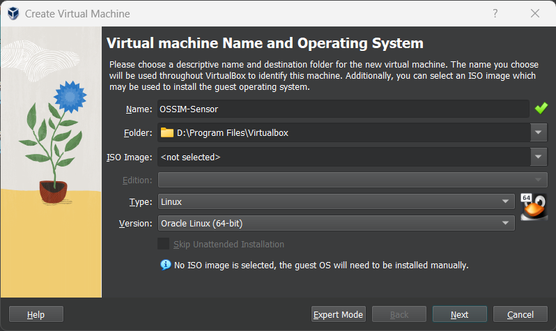
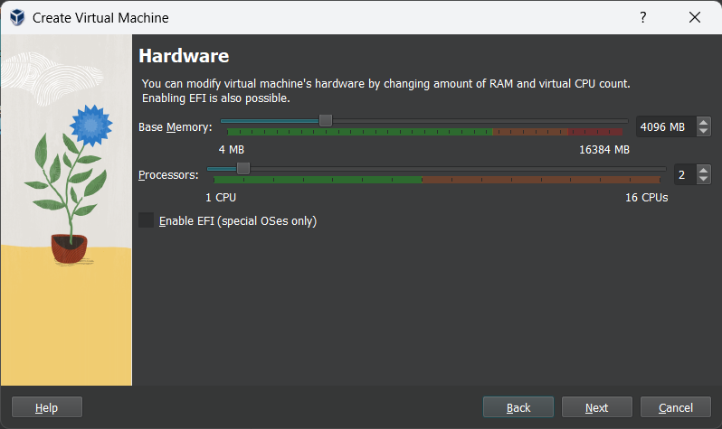
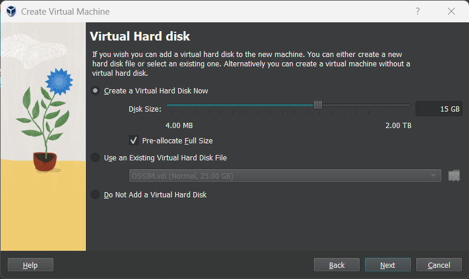

## ساخت ماشین مجازی 

1. یک ماشین مجازی جدید ایجاد کنید. Type را Linux  و Version را Debian (64-bit) انتخاب کنید. فعلا نیازی به انتخاب فایل iso نیست.

2. برای OSSIM Sensor حداقل 6 گیگابایت رم و 2 هسته پردازنده به ماشین مجازی اختصاص دهید.

3. حداقل 15 گیگابایت فضای ذخیره سازی اختصاص داده و تیک Pre-allocate Full Size را نیز بزنید.

4. Finish را بزنید و صبر کنید تا ماشین مجازی ساخته شود.

5. ماشین مجازی را اجرا کنید.

6. حال فایل `AlienVault_OSSIM_64bits.iso` انتخاب کنید و Mount and Retry Boot را بزنید.

7. پس از بوت شدن، نصب OSSIM Sensor را آغاز می‌کنیم.

## نصب OSSIM Sensor

:::note
از آن جایی که OSSIM یک نسخه شخصی سازی شده از توزیع لینوکس دبیان است، نحوه نصب آن نیز مشابه با نصب لینوکس می‌باشد.
:::

1. ابتدا گزینه دوم یعنی Install AlienVault OSSIM Sensor را انتخاب کنید.

2. زبان، کشور، ساعت را انتخاب کرده تا به صفحه تنظیمات شبکه برسید.

3. اینجا آدرس 192.168.10.11 را به OSSIM Server اختصاص می‌دهیم.

4. سایر تنظیمات شبکه مثل Gateway و DNS Server را تغییر ندهید (بر روی 192.168.10.1 باشند) و نصب را تا پایان ادامه دهید.

5. پروسه نصب حدودا 30 دقیقه طول خواهد کشید و پس از آن صفحه لاگین OSSIM Sensor را مشاهده خواهید کرد.