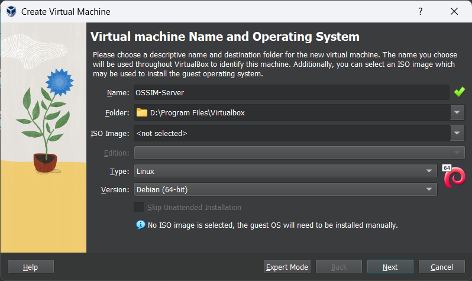
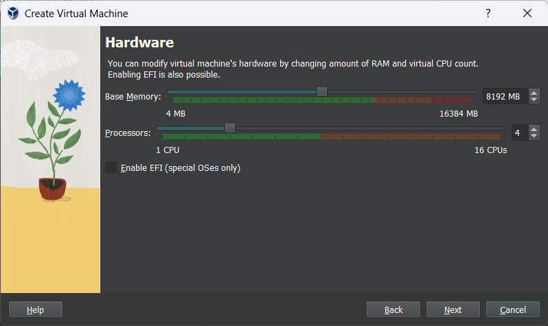
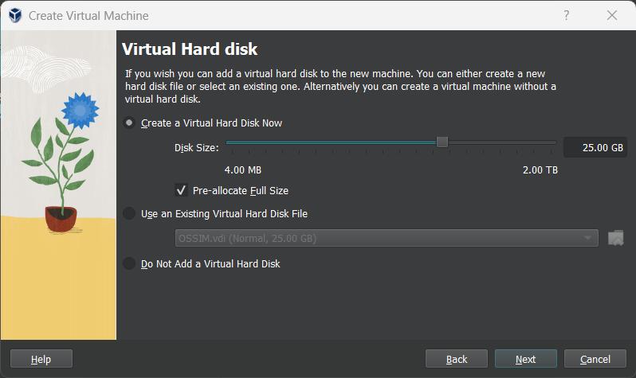
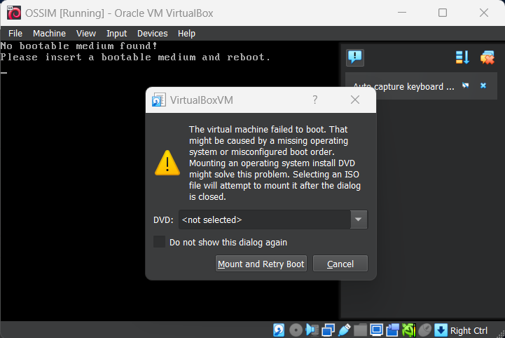
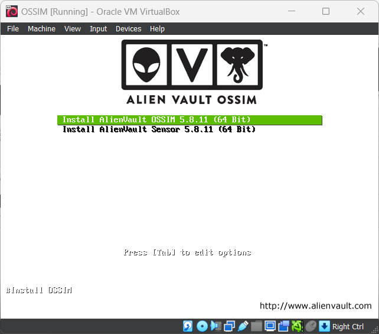

## ساخت ماشین مجازی

1. یک ماشین مجازی جدید ایجاد کنید. Type را Linux  و Version را Debian (64-bit) انتخاب کنید. فعلا نیازی به انتخاب فایل iso نیست.

2. برای OSSIM Server حداقل 8 گیگابایت رم و 3 هسته پردازنده به ماشین مجازی اختصاص دهید.

3. حداقل 25 گیگابایت فضای ذخیره سازی اختصاص داده و تیک Pre-allocate Full Size را نیز بزنید.

4. Finish را بزنید و صبر کنید تا ماشین مجازی ساخته شود.

6. ماشین مجازی را اجرا کنید.
7. حال فایل `AlienVault_OSSIM_64bits.iso` انتخاب کنید و Mount and Retry Boot را بزنید.

8. پس از بوت شدن، نصب OSSIM Server را آغاز می‌کنیم.

## نصب OSSIM Server

:::note
از آن جایی که OSSIM یک نسخه شخصی سازی شده از توزیع لینوکس دبیان است، نحوه نصب آن نیز مشابه با نصب لینوکس می‌باشد.
:::

1. ابتدا گزینه اول یعنی Install AlienVault OSSIM Server را انتخاب کنید.

2. زبان، کشور، ساعت را انتخاب کرده تا به صفحه تنظیمات شبکه برسید.

3. اینجا آدرس 192.168.10.10 که در قسمت قبل گفتیم را به OSSIM Server اختصاص می‌دهیم.

4. سایر تنظیمات شبکه مثل Gateway و DNS Server را تغییر ندهید (بر روی 192.168.10.1 باشند) و نصب را تا پایان ادامه دهید.

5. پروسه نصب حدودا 30 دقیقه طول خواهد کشید و پس از آن صفحه لاگین OSSIM Server را مشاهده خواهید کرد.